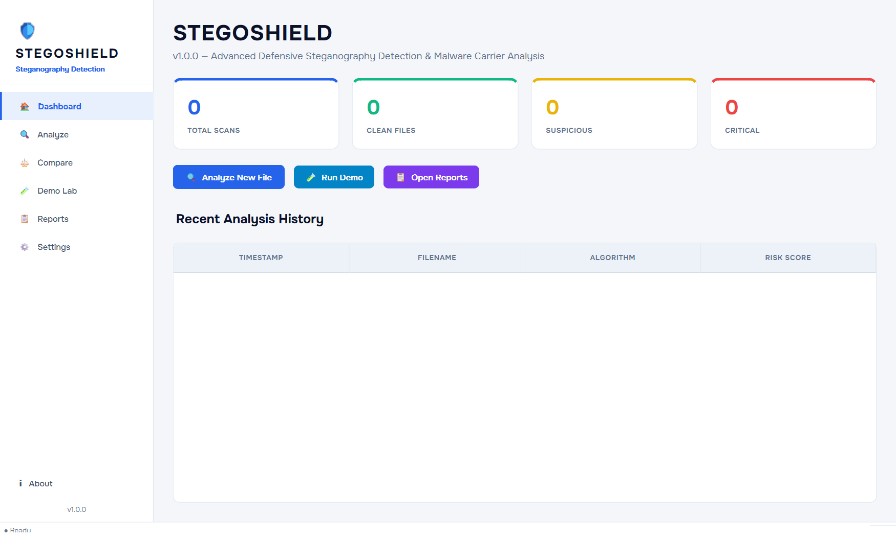
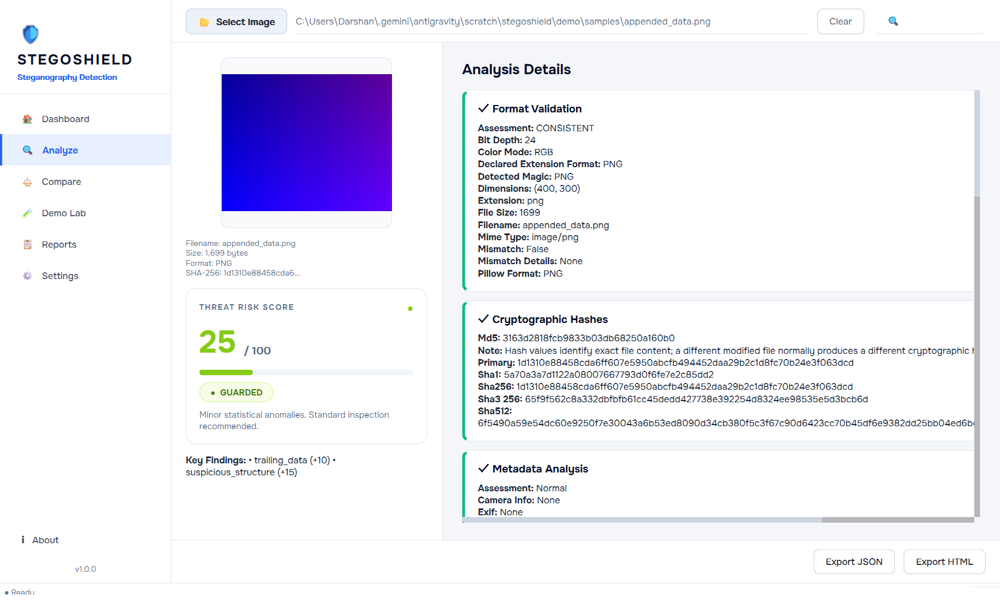

# 🛡️ StegoShield

> **Steganographic Malware Carrier Detection & Static Analysis Suite**  
> *A defensive cybersecurity research prototype designed for malware analysis, digital forensics, and classroom demonstration.*

---

## 📸 Interface Preview

### 🏠 Dashboard Overview


### 🔍 Threat Analysis & Risk Breakdown


---

## 🎯 Project Overview

Recent cyber threat actors and malware campaigns frequently leverage steganography—embedding malicious executables, encoded commands, or shellcode into innocent-looking image files (`.png`, `.jpg`, `.bmp`).

**StegoShield** is a dedicated static analysis framework that inspects media files for steganographic carriers and suspicious payloads **without ever executing or detonating the file**.

---

## ✨ Key Features & Analysis Modules

| Module | Purpose | Detection Logic |
|---|---|---|
| 🔐 **Cryptographic Hashing** | File Fingerprinting | Computes MD5, SHA-1, SHA-256, SHA-384, SHA-512 |
| 📋 **Format Validator** | Extension Mismatch | Compares declared file extension against True Magic Bytes |
| 📊 **Shannon Entropy** | Encrypted/Packed Data | Block-level and file-wide randomness analysis |
| 📎 **Trailing Data Detection** | Appended Payloads | Detects data past logical `IEND` (PNG) / `EOI` (JPEG) EOF markers |
| 🔬 **LSB Statistical Analysis** | Pixel Domain Steganography | Chi-Square test, Pair of Values (PoV), inter-channel variance |
| 🧩 **PNG Chunk Analysis** | Structure Tampering | Inspects critical & ancillary chunks (`tEXt`, `zTXt`, `IDAT`) |
| 🖼️ **JPEG Marker Inspection** | Structure Verification | Scans COM comments, restart markers, and abnormal segments |
| 🔤 **Suspicious Strings & URLs** | Heuristic Extraction | Identifies encoded commands (Base64, PowerShell, URLs, IPs) |
| 🗂️ **Embedded Signatures** | Nested Payloads | Scans for PE headers (`MZ`/`PE`), ZIP/RAR/7z archives, ELF binaries |
| 🛡️ **Weighted Risk Engine** | Explainable Scoring | Aggregates indicators into an intuitive 0–100 Threat Score |
| 📄 **Report Generator** | Forensic Output | Exports structured JSON data and styled HTML reports |

---

## 🏗️ Architecture

```text
stegoshield/
├── core/                   # Static analysis & forensic modules
│   ├── analyzer.py         # Multi-module orchestrator
│   ├── risk_engine.py      # Weighted risk scoring engine
│   ├── format_validator.py # Magic bytes & header validation
│   ├── hashing.py          # Cryptographic hashing
│   ├── entropy.py          # Shannon entropy calculator
│   ├── trailing_data.py    # EOF trailing byte detector
│   ├── lsb_analyzer.py     # LSB Chi-Square & statistical analysis
│   ├── png_analyzer.py     # PNG chunk inspector
│   ├── jpeg_analyzer.py    # JPEG structure & marker parser
│   ├── noise_analyzer.py   # Pixel noise & residual analysis
│   ├── strings.py          # ASCII/Unicode string & URL extractor
│   ├── embedded_data.py    # Nested executable/archive scanner
│   ├── metadata.py         # EXIF & metadata analyzer
│   └── report_generator.py # JSON & HTML forensic export
├── gui/                    # Modern PySide6 Desktop GUI
│   ├── theme.py            # Datify Light Visual Identity & Onest typography
│   ├── main_window.py      # Navigation shell & layout
│   ├── dashboard.py        # Analytics dashboard
│   ├── analyze_view.py     # Real-time analysis view & threat scorecard
│   ├── compare_view.py     # Side-by-side differential analysis
│   ├── demo_view.py        # Synthetic test lab
│   ├── report_view.py      # Report browser
│   ├── settings_view.py    # Dynamic risk weight configuration
│   └── about_view.py       # Tool info & legal disclaimers
├── config/
│   └── scoring.json        # Configurable indicator weights & thresholds
├── demo/
│   ├── generate_samples.py # Safe synthetic test carrier generator
│   └── samples/            # Pre-generated sample images
├── fonts/                  # Bundled Onest font files
├── tests/                  # Pytest automated unit test suite (28/28 passing)
├── assets/                 # Readme screenshots
├── app.py                  # Main GUI entry point
├── requirements.txt        # Project dependencies
└── README.md
```

---

## ⚡ Quick Start

### 1. Prerequisites
- **Python 3.10+** (Tested on Python 3.11)
- Git

### 2. Clone the Repository
```bash
git clone https://github.com/<your-username>/stegoshield.git
cd stegoshield
```

### 3. Install Dependencies
```bash
pip install -r requirements.txt
```

### 4. Launch Application
```bash
python app.py
```

---

## 🧪 Running Automated Tests

Run the test suite with **pytest**:
```bash
python -m pytest tests/ -v
```

All 28 forensic module tests validate:
- Format mismatch detection
- Trailing byte identification
- LSB statistical detection
- Embedded binary signature parsing
- Risk engine scoring calibration

---

## ⚖️ Ethical & Defensive Scope

- **Purely Defensive**: This tool performs offline static analysis only.
- **No Payload Execution**: Does **not** execute, unpack, or detonate embedded binaries or scripts.
- **Educational & Research Focus**: Built for academic study in malware analysis and digital forensics.

---

## 📄 License
This project is open-source under the [MIT License](LICENSE).
